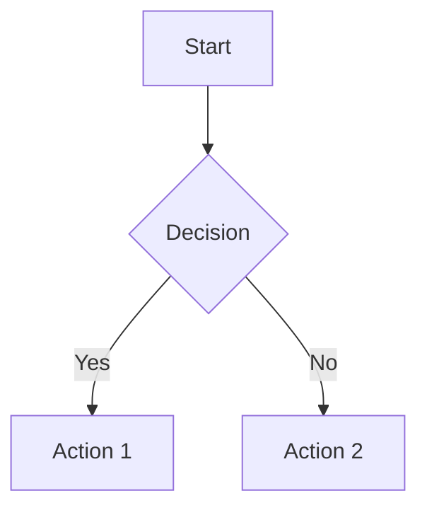

# Markdown Test Page

This page demonstrates various Markdown features supported by the blog.

## Text Formatting

*Italic text* and _more italic_
**Bold text** and __more bold__
***Bold and italic*** and ___more bold and italic___
~~Strikethrough text~~

## Lists

### Unordered Lists
- Item 1
- Item 2
  - Nested item 2.1
  - Nested item 2.2
- Item 3

### Ordered Lists
1. First item
2. Second item
   1. Nested item 2.1
   2. Nested item 2.2
3. Third item

## Links and Images

[External link](https://example.com)
[Internal link](/posts/test-html-features)


## Code

Inline `code` example

```javascript
// Code block with syntax highlighting
function example() {
  const message = "Hello, World!";
  console.log(message);
}
```

## Blockquotes

> Single line blockquote
>
> Multiline blockquote
> with multiple paragraphs
>
> > Nested blockquotes

## Tables

| Header 1 | Header 2 | Header 3 |
|----------|----------|----------|
| Cell 1   | Cell 2   | Cell 3   |
| Cell 4   | Cell 5   | Cell 6   |

## Task Lists

- [x] Completed task
- [ ] Incomplete task
- [x] Another completed task
  - [ ] Nested incomplete task
  - [x] Nested completed task

## Footnotes

Here's a sentence with a footnote[^1].

[^1]: This is the footnote content.

## Horizontal Rules

---

***

___

## Extended Features

### Mermaid Diagrams



### Math Equations

Inline equation: $E = mc^2$

Block equation:
$$
\frac{-b \pm \sqrt{b^2 - 4ac}}{2a}
$$

### Custom Container

:::note
This is a custom note container
:::

:::warning
This is a custom warning container
:::
